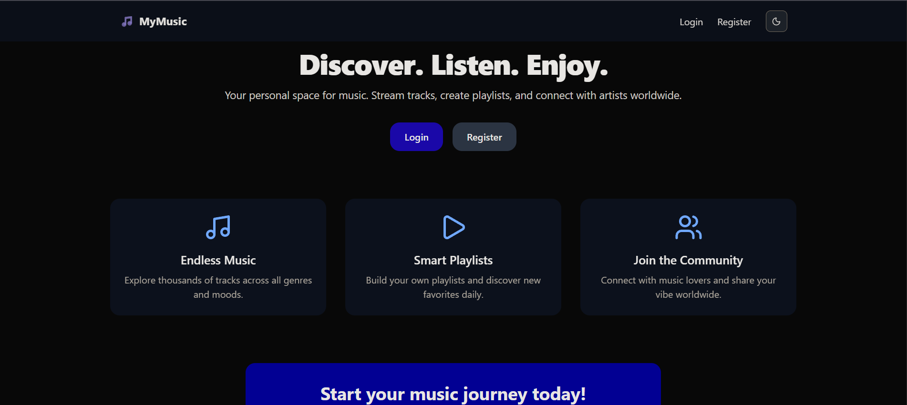

# 🎵 Tracks Web Application (Backend & Frontend)

> Полноценное **Full-Stack** веб-приложение для управления и просмотра музыкальных треков.  
> Создано с использованием **Django (Backend)** и **Next.js (Frontend)**.

---

## ⚙️ Backend — Django REST API

### 🧩 Основные технологии

| Технология | Назначение | Документация |
|-------------|-------------|---------------|
| **Django** | Основной backend-фреймворк | [djangoproject.com](https://www.djangoproject.com/) |
| **Django REST Framework** | Создание REST API | [django-rest-framework.org](https://www.django-rest-framework.org/) |
| **PostgreSQL** | Реляционная база данных | [postgresql.org](https://www.postgresql.org/) |
| **Gunicorn** | WSGI сервер для продакшена | [gunicorn.org](https://gunicorn.org/) |
| **Celery + Redis** | Асинхронные задачи и очереди | [celeryq.dev](https://docs.celeryq.dev/) |
| **Django CORS Headers** | Связь с фронтендом (CORS) | [pypi.org/project/django-cors-headers](https://pypi.org/project/django-cors-headers/) |
| **DRF SimpleJWT** | JWT-аутентификация | [django-rest-framework-simplejwt.readthedocs.io](https://django-rest-framework-simplejwt.readthedocs.io/) |
| **DRF Spectacular** | Документация OpenAPI/Swagger | [drf-spectacular.readthedocs.io](https://drf-spectacular.readthedocs.io/) |
| **CKEditor 5** | Редактор текста в админке | [ckeditor.com](https://ckeditor.com/) |
| **Jazzmin / Unfold** | Современные темы для Django Admin | [github.com/farridav/django-jazzmin](https://github.com/farridav/django-jazzmin) |
| **Flower** | Мониторинг задач Celery | [flower.readthedocs.io](https://flower.readthedocs.io/) |
| **Prometheus** | Метрики производительности | [prometheus.io](https://prometheus.io/) |
| **Sentry** | Мониторинг ошибок | [sentry.io](https://sentry.io/) |
| **Docker** | Контейнеризация приложения | [docker.com](https://www.docker.com/) |
| **Pre-commit** | Автоматизация проверок кода | [pre-commit.com](https://pre-commit.com/) |
| **Ruff** | Линтер и автоформатер Python | [docs.astral.sh/ruff](https://docs.astral.sh/ruff/) |
| **Mypy** | Статическая типизация Python | [mypy-lang.org](https://mypy-lang.org/) |
| **Pytest** | Тестирование backend-кода | [pytest.org](https://pytest.org/) |
| **Taskfile** | Автоматизация задач | [taskfile.dev](https://taskfile.dev/) |
| **uv** | Быстрый менеджер зависимостей Python | [docs.astral.sh/uv](https://docs.astral.sh/uv/) |

---

### 🚀 Установка и запуск Backend

```bash
# 1️⃣ Клонируй репозиторий
git clone https://github.com/RustamovAkrom/Tracks-BF.git
cd Tracks-BF/Backend

# 2️⃣ Создай виртуальное окружение
python -m venv .venv
.venv\Scripts\activate      # Windows
source .venv/bin/activate   # Linux / Mac

# 3️⃣ Установи зависимости
pip install -r requirements.txt

# 4️⃣ Настрой .env файл
cp .env.example .env

# 5️⃣ Применить миграции и запустить сервер
python manage.py migrate
python manage.py runserver
````

---

## 💻 Frontend — Next.js App

### 🧩 Основные технологии

| Технология                | Назначение            | Документация                                              |
| ------------------------- | --------------------- | --------------------------------------------------------- |
| **Next.js 15 (React 19)** | Фреймворк для SSR/SPA | [nextjs.org](https://nextjs.org/)                         |
| **Tailwind CSS 4**        | Быстрая стилизация    | [tailwindcss.com](https://tailwindcss.com/)               |
| **Framer Motion**         | Анимации интерфейса   | [framer.com/motion](https://www.framer.com/motion/)       |
| **Axios**                 | HTTP-запросы к API    | [axios-http.com](https://axios-http.com/)                 |
| **Lucide React**          | Современные иконки    | [lucide.dev](https://lucide.dev/)                         |
| **Radix UI**              | Компоненты интерфейса | [radix-ui.com](https://www.radix-ui.com/)                 |
| **Next Themes**           | Светлая/тёмная тема   | [next-themes](https://github.com/pacocoursey/next-themes) |
| **TypeScript**            | Статическая типизация | [typescriptlang.org](https://www.typescriptlang.org/)     |
| **ESLint**                | Линтинг JS/TS кода    | [eslint.org](https://eslint.org/)                         |

---

### 🚀 Установка и запуск Frontend

```bash
# 1️⃣ Перейди в папку фронтенда
cd ../Frontend

# 2️⃣ Установи зависимости
npm install

# 3️⃣ Запусти dev-сервер
npm run dev
```

После запуска приложение будет доступно по адресу:
👉 **[http://localhost:3000](http://localhost:3000)**

---

## 📁 Структура проекта

```
Tracks-BF/
│
├── Backend/
│   ├── manage.py
│   ├── requirements.txt
│   └── tracks/ (основное Django-приложение)
│
├── Frontend/
│   ├── package.json
│   ├── next.config.js
│   └── src/
│
└── README.md
```

---

## 👨‍💻 Автор

**Rustamov Akrom**
📎 [GitHub Profile](https://github.com/RustamovAkrom)

---

## 🌟 Идеи для улучшений

* Docker Compose (Frontend + Backend)
* Автоматические тесты CI/CD
* Интернационализация (i18n)
* Улучшенная аналитика с Prometheus + Grafana
* Push-уведомления и realtime обновления через WebSockets

---

> ✨ *Tracks-BF — современный музыкальный веб-сервис на Django + Next.js.*
